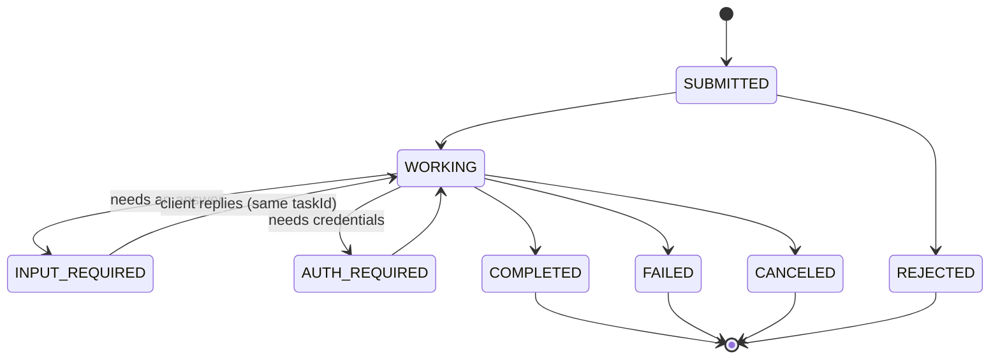

# A2A in five minutes

A2A (Agent2Agent) is an open protocol from the Linux Foundation that lets **AI agents hand work to other agents**. Each agent stays a black box: the caller never sees the other agent's prompts, tools or memory, only what its card says it can do. The full text is the [specification](https://a2a-protocol.org/latest/specification/). This page is the short version.

## A2A vs MCP

- **MCP** connects an agent to **tools and data**.
- **A2A** connects an agent to **other agents**.

An A2A agent often uses MCP inside to get its work done.

## The objects

| Object | What it is |
|---|---|
| **Agent Card** | JSON at `/.well-known/agent-card.json`: name, skills, capabilities (streaming, push), endpoints, and which auth it accepts |
| **Message** | One turn from the user or the agent. Made of **Parts** |
| **Part** | Exactly one of: `text`, `raw` (bytes), `url` (a file link) or `data` (any JSON) |
| **Task** | A unit of work with an id, a status and a history. Long work is a task |
| **Artifact** | An output of a task (a document, an image, JSON), made of Parts |
| **contextId** | Groups related tasks and messages into one conversation |

## The task lifecycle

A task in a final state never changes again. For a paused task, the client sends a new message with the same `taskId`.

## The operations

| Operation | JSON-RPC | REST |
|---|---|---|
| Send a message | `SendMessage` | `POST /message:send` |
| Send and stream | `SendStreamingMessage` | `POST /message:stream` (SSE) |
| Get / list tasks | `GetTask`, `ListTasks` | `GET /tasks/{id}`, `GET /tasks` |
| Cancel | `CancelTask` | `POST /tasks/{id}:cancel` |
| Re-attach to a stream | `SubscribeToTask` | `POST /tasks/{id}:subscribe` |
| Push notifications | `Create/Get/List/DeleteTaskPushNotificationConfig` | `/tasks/{id}/pushNotificationConfigs` |

Every request carries an `A2A-Version: 1.0` header. The SDK handles all of this; you write the executor.
