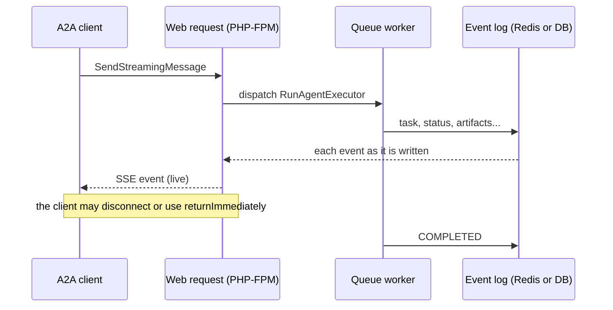

# Laravel: queued execution

By default (`a2a.runner = inline`) the executor runs inside the web request. That is fine for agents that answer in a second or two. For anything longer, run executors on your queue workers:

```php
// config/a2a.php
'runner' => 'queued',
```

or per agent: `Route::a2a('/a2a', ..., runner: 'queued')`.

## What happens



1. The web request dispatches a `RunAgentExecutor` job and then reads the task's events from the event log, streaming each one to the client as the worker writes it. A blocking `SendMessage` returns as soon as the task finishes or pauses.
2. The worker runs your executor. Only one run per task executes at a time: the job holds the task's run lease, and a follow-up message for the same task waits for it (that is why the job is not `ShouldBeUnique`: that would drop the follow-up).
3. The web request can end at any point, because of `returnImmediately`, a disconnect or a timeout, and the worker keeps going. Clients can `GetTask` or `SubscribeToTask` later, from any server.

Executor errors come back to the caller the same way as with the inline runner: A2A errors keep their code, anything else is a generic "Internal error" (the details go to the worker's log).

## Running workers

Any Laravel queue driver works. The job goes to `a2a.queue.connection` / `a2a.queue.name` (your defaults if unset).

```bash
php artisan queue:work --timeout=3600
```

!!! warning "Timeouts"
    `a2a.queue.timeout` (default 3600 s) is the job's `$timeout`, so it wins over the worker's `--timeout`. Keep it **below the connection's `retry_after`**, or the queue hands a still-running job to a second worker. The job also refuses to start a run that has already finished, as a safety net.

The examples below use a dedicated `a2a` queue (`A2A_QUEUE=a2a`), so long agent runs don't hold up your other jobs.

With **Horizon**, give the A2A queue a supervisor with enough processes for the tasks you run at once (each running task holds one worker until it ends):

```php
// config/horizon.php
'environments' => [
    'production' => [
        'a2a' => [
            'connection' => 'redis',
            'queue' => ['a2a'],
            'maxProcesses' => 20,
            'timeout' => 3600,
        ],
    ],
],
```

With **supervisor**:

```ini
[program:a2a-worker]
command=php /var/www/app/artisan queue:work redis --queue=a2a --timeout=3600 --sleep=0.1
numprocs=8
process_name=%(program_name)s_%(process_num)02d
autorestart=true
stopwaitsecs=3600
```

If no worker picks a job up within `a2a.queue.start_timeout` seconds (default 30), the call fails with a clear error instead of hanging.

## Cancellation

`CancelTask` sets a cancel flag in the event log. The worker's executor sees it at its next event: it gets `cancel()` called and its `execute()` is stopped. In long loops, check `$context->isCancelled()` yourself between steps, so a cancel takes effect even when you are not publishing anything. If the worker hasn't stopped within 10 seconds, the cancel request marks the task canceled itself.

## The event log: Redis or database

```php
// config/a2a.php
'events' => [
    'driver' => 'redis',   // or 'database'
],
```

| Driver | How a waiting request learns about a new event | Good for |
|---|---|---|
| `redis` | Redis Streams, `XREAD BLOCK`: it wakes up at once | production |
| `database` | polls the `a2a_task_events` table every `a2a.sse.poll` seconds (0.25 s) | small setups, no Redis |

Redis keys expire on their own (`a2a.events.finished_ttl` after a task ends, `active_ttl` otherwise). Database events are removed by `a2a:prune`.

The run markers (waiting, started, finished) live in the cache store `a2a.queue.cache_store`. It must be shared by web and worker processes: Redis, database, Memcached, or `file` on a single machine. Not `array`.
